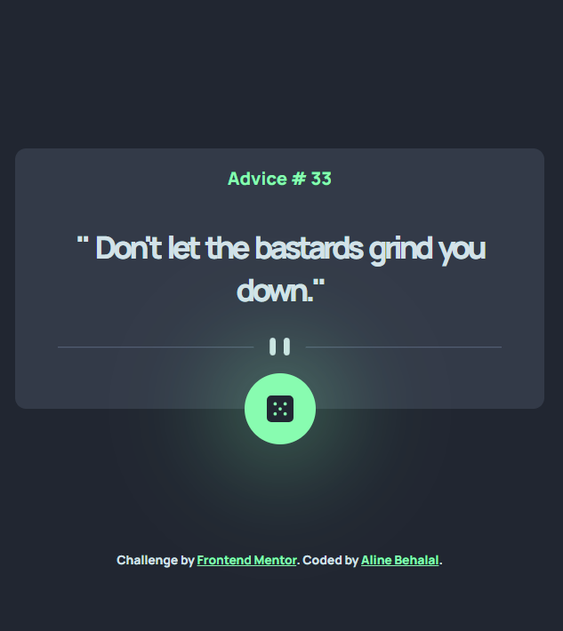

# Frontend Mentor - Advice generator app solution


This is a solution to the [Advice generator app challenge on Frontend Mentor](https://www.frontendmentor.io/challenges/advice-generator-app-QdUG-13db). Frontend Mentor challenges help you improve your coding skills by building realistic projects.

## Table of contents

- [Overview](#overview)
  - [The challenge](#the-challenge)
  - [Screenshot](#screenshot)
  - [Links](#links)
- [My process](#my-process)
  - [Built with](#built-with)
  - [What I learned](#what-i-learned)
  - [Continued development](#continued-development)
  - [Useful resources](#useful-resources)
- [Author](#author)

## Overview

### The challenge

Users should be able to:

- View the optimal layout for the app depending on their device's screen size
- See hover states for all interactive elements on the page
- Generate a new piece of advice by clicking the dice icon

### Screenshot

<strong>Mobile version</strong>


<strong>Desktop version</strong>


<strong>Desktop version active state</strong>



### Links

- Solution URL: [https://github.com/Hileene/Advice-generator-app](https://github.com/Hileene/Advice-generator-app)
- Live Site URL: [https://hileene.github.io/Advice-generator-app/](https://hileene.github.io/Advice-generator-app/)

## My process

The Advice Generator project followed a multi-stage development process to maintain a structured and responsive layout.

### 1. HTML Structure

The initial phase focused on creating a clean and semantic HTML structure. This involved defining the basic layout, including the main container, advice display area, and the button to trigger new advice. Proper use of HTML5 elements ensured accessibility and readability.

### 2. CSS Styling (Mobile First)

In the second stage, mobile-first CSS styling was applied. This approach prioritized the mobile user experience, ensuring that the layout was optimized for small screens. Key steps included:

- Setting a responsive viewport.
- Utilizing flexible units like percentages and rems for scaling.
- Implementing a column layout for the main container and centering elements using flexbox.

### 3. CSS Styling (Tablet and Desktop)

Building on the mobile-first foundation, media queries were introduced to enhance the design for tablet and desktop views. This involved:

- Adjusting the layout to utilize larger screens effectively.
- Enhancing the visual hierarchy and spacing to maintain a clean and organized appearance across different devices.

### 4. TypeScript for the Generator Logic

The final stage involved integrating TypeScript to manage the advice generator logic. This included:

- Fetching data from the API asynchronously and handling responses with promises.
- Typing the API response to ensure type safety and predictability.
- Updating the DOM with new advice and IDs while handling potential null values to prevent runtime errors.

### Built with

- Semantic HTML5 markup
- CSS custom properties
- Flexbox
- Typescript
- Mobile-first workflow

### What I learned

For this project, I wanted to start learning TypeScript and understand its benefits compare to Javascript. It was a small project so It was easy enough to learn the bases of TypeScript. I started the logic for the generator in JavaScript and after I updated in TypeScript.

What was tricky though was to understand why the button, advice ID and advice text elements were marked as "possibly null" by TypeScript although these elements are find in the DOM with only JavaScript. Even if my JavaScript code was working perfectly, TypeScript's goal is to make sure our code is robust and handles all potential edge cases, including the possibility of elements not being found in the DOM.

Because I was sure my element will never be "null" I added the non-null assertion operator (!). The other possibility was to add a "if" statement.

To see how you can add code snippets, see below:

```typescript
const btnAdvice = document.querySelector<HTMLDivElement>('#btnAdvice')!

const adviceIdElement = document.querySelector('#adviceId')!
const adviceTextElement = document.querySelector('#adviceText')!
```

### Continued development

Of course, It was my first step experiencing TypeScript and I will continue build project with it. But also keep improving my JS skills.

### Useful resources

- [Découvrez TypeScript - Openclassrooms](https://openclassrooms.com/fr/courses/8039116-decouvrez-typescript/8166571-tirez-un-maximum-de-ce-cours) - This helped to learn TypeScript bases with pratical exercices.
- [TypeScript Handbook - The Basics - Everyday Types](https://www.typescriptlang.org/docs/handbook/2/everyday-types.html#non-null-assertion-operator-postfix-) - The TypeScript documentation is of course the first tool to learn the language and here it helped me with the "null" elements errors.

## Author

- Website - [Aline Behalal](https://aline-behalal.netlify.app/)
- Frontend Mentor - [@Hileene](https://www.frontendmentor.io/profile/Hileene)
